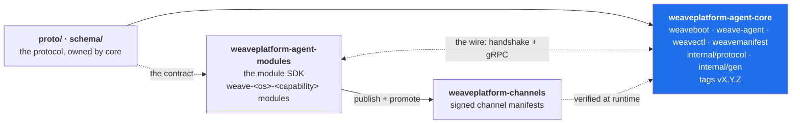

# weaveplatform-agent-core

The weave agent core: one agent for any device or container, physical or virtual — a
laptop, a VM on that laptop, a VM on a cloud host, a container on a device or in the cloud.
It presents a single install footprint and a single identity to an administrator, and
behind that it verifies, runs and supervises **modules**: separate signed binaries, one per
capability per OS (`weave-linux-presence`, `weave-windows-exec`, …), fetched and promoted at
runtime from a signed channel.

Core is driven by the host directly outside it, over one authenticated host channel: the
hypervisor of a VM, or the runtime of a container
([`docs/architecture.md`](docs/architecture.md#the-hypervisor-channel)).

**Core is infrastructure with no opinion about what the platform does.** It knows how to be
one authenticated, policied, supervised presence on a machine, and nothing about what a
module is for. That keeps the single point of failure for the whole product line boring.

## The Terraform model

Core is to its modules what Terraform core is to providers
([`docs/decisions/0001`](docs/decisions/0001-core-owns-its-protocol.md)):

| Terraform | Weave |
|---|---|
| `hashicorp/terraform`: the CLI and core; owns the plugin protocol (`docs/plugin-protocol/*.proto`) and keeps a private implementation (`internal/tfplugin5`, `internal/plugin`) | **this repository**: `weave-agent`, `weaveboot`, `weavectl`, `weavemanifest`; owns `proto/` and `schema/`; private implementation under `internal/` |
| `terraform-plugin-go`, `-framework`, `-testing`, and every provider in its own repository | [`weaveplatform-agent-modules`](https://github.com/weaveplatform/weaveplatform-agent-modules): the module SDK and every `weave-<os>-<capability>` module, each with its own release |
| The Terraform Registry | [`weaveplatform-channels`](https://github.com/weaveplatform/weaveplatform-channels): signed channel manifests saying which module versions a device may run |

Core launches modules the same way Terraform launches providers: verify the signature,
spawn, handshake, then speak gRPC over a local socket for the process lifetime. Core and
modules agree on the wire, never on a Go package: core imports nothing from
`weaveplatform-agent-modules`, and CI fails if it does.



The full architecture is in [`spec.md`](spec.md); read it before changing anything here.
[`docs/`](docs/README.md) covers how the pieces fit, the protocol and its versioning, the
service map, packaging, and development.

## Layout

One repository, one Go module, `github.com/weaveplatform/weaveplatform-agent-core`.

| Path | What |
|---|---|
| `cmd/weave-agent` | Core: the supervised, authenticated presence on the machine |
| `cmd/weaveboot` | Supervises core so core can be replaced in place — staged, health-gated, with rollback; on Windows also the `WeaveAgent` service and its installer ([`docs/windows-install.md`](docs/windows-install.md)) |
| `cmd/weavectl` | Operator CLI over the control socket |
| `cmd/weavemanifest` | Mints and verifies the channel-manifest signing chain; its verify *is* `internal/manifestverify`, so a manifest it accepts is one core accepts |
| `internal/supervise` | Module supervision: verify-before-exec, privilege drop, per-user console sessions, handshake, health, crash-loop breaker |
| `internal/lifecycle` | Module install: fetch, stage, health-gated promote, N-1 retention, rollback |
| `internal/hostserv`, `internal/controlsock` | The host services modules call, and the operator control socket |
| `internal/verify`, `internal/manifestverify` | Binary signatures per OS, and the signed channel manifest |
| `internal/transport`, `internal/capability` | The host channel (virtio-serial, vsock, HvSocket, Unix socket) and the capability probe |
| `internal/store`, `internal/identity`, `internal/policy`, `internal/eventbus`, `internal/session` | Encrypted store, device identity, policy delivery, event bus, console sessions |
| `internal/weaveboot`, `internal/winsvc`, `internal/layout` | Core replacement, the Windows service, the on-disk layout |
| `internal/core`, `internal/retry`, `internal/wlog`, `internal/werror`, `internal/platform`, `internal/version` | Core's wiring and protocol window; backoff, logging, error conventions, the OS seam, the build version |
| `internal/protocol` | Core's own implementation of the wire: `handshake`, `ipc`, `hvchannel`, `manifest` |
| `internal/gen` | Generated from `proto/` by `buf generate`; committed, and CI fails if it drifts |
| `proto/`, `schema/` | The protocol (`weave/agent/v1`, `weave/control/v1`) and the manifest JSON Schemas |
| `packaging/` | The deb (systemd unit and scripts), the Windows installer, the apt repository tool, the cloud-init bring-up seed |
| `test/protocompat` | Core at protocol N accepts a pinned N-1 module and cleanly refuses one outside the window |

## Building

```sh
make build        # every cmd/* binary for linux, darwin, windows × amd64, arm64 into bin/
make gate         # everything CI runs: vet, lint, test, coverage, govulncheck, build, protocol checks
```

Everything is pure Go and builds with `CGO_ENABLED=0` for every platform. The Makefile sets
`GOWORK=off`. [`docs/development.md`](docs/development.md) covers the tools, running the
agent locally, and testing.

## Releasing

release-please keeps a release PR open on `main`; merging it tags `vX.Y.Z`, and the tag runs
goreleaser: per-platform archives of the four binaries, the `weave-agent` `.deb`, and a
checksum file signed keylessly with cosign. Core ships no modules. See
[`docs/development.md`](docs/development.md#releasing).

## Writing a module

Modules are not written here. Build against the module SDK,
`github.com/weaveplatform/weaveplatform-agent-modules/sdk`, starting from
[`sdk/docs/writing-a-module.md`](https://github.com/weaveplatform/weaveplatform-agent-modules/blob/main/sdk/docs/writing-a-module.md)
in `weaveplatform-agent-modules`, where every module lives.
