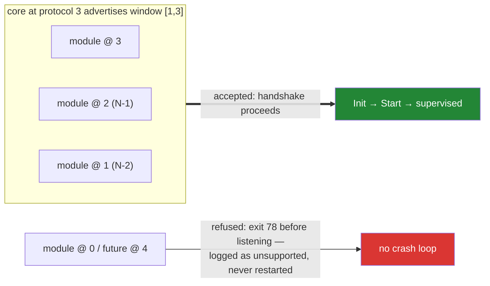

# The protocol

Three numbers version this platform: core's semver, each module's product semver, and **the
protocol integer** between them. This document owns the integer.

## What the integer is

The protocol is the wire contract a module builds against: the proto package `weave/agent/v1`,
the handshake environment and stdout line, and the capability vocabulary. Proto package `v<N>`
**is** protocol N. (The `go-bindings-*` versions are pinned separately, in the channel
manifest — see Bindings pinning below.)

Core advertises `{min, max}` at spawn (`WEAVE_PROTOCOL_MIN`, `WEAVE_PROTOCOL_MAX`). Each module
declares the single protocol it speaks. Compatibility is negotiated at handshake, never
tabulated. **An N-2 window is the default**: core at protocol N accepts modules built against
N-1 and N-2 and cleanly refuses anything older.



The refusal path is as designed as the acceptance path: `test/protocompat` keeps a pinned
module for each protocol in the window and proves both directions on every CI run. How a new
protocol is added and released is in [`protocol-versioning.md`](protocol-versioning.md).

## What bumps the integer

A protocol bump is rare and deliberate — a design review, not a side effect. Bump when:

- a wire-visible message or RPC changes incompatibly (buf breaking-change checks gate this);
- the handshake environment or stdout line changes shape;
- the capability vocabulary changes meaning (adding a new capability name is *not* a bump).

A `go-bindings-*` version change is **not** a protocol bump — it is a channel event (see
Bindings pinning).

A bump means a new proto package (`weave/agent/v2`) beside the old one. Core serves both for
the length of the window. The old package is deleted only when it falls out of the window.

## What does not bump the integer

- Adding an optional field to an existing message.
- Adding a new capability name (modules that require it simply don't launch on hosts without it).
- Core releases. Module releases. Anything semver'd.

## Bindings pinning

The `go-bindings-*` versions the current protocol expects are recorded in the channel
manifest's `bindings` block and version on **their own cadence** — a bindings bump is a
*channel* event (re-sign the manifest), not a protocol-integer bump and not a proto-package
fork. Decoupling the two keeps a library refresh from forcing every module to rebuild against
a new `weave/agent/vN` when no wire byte changed. The integer moves only for wire-visible
changes (see above); the manifest's `bindings` block is where "which library the fleet runs"
is pinned and rolled.

## Additive change, worked example

The policy envelope (`schema_version`, `content_type` on `PolicyDocument`), event sequence
numbers (`sequence` on `Event`), the standard `grpc.health.v1` service, and the push
`WatchdogService` (plus `watchdog_interval_seconds` on `InitRequest`), and the read-only
`RegistryService` were all added under
protocol **1**: new optional fields and new services are wire-compatible, so by the rules
above they do not bump the integer. A protocol-2 package is minted only when a genuinely
breaking change lands, at which point `test/protocompat/v2` is added beside `v1`.

## The handshake

```
core → module    env: WEAVE_PROTOCOL_MIN, WEAVE_PROTOCOL_MAX, WEAVE_HANDSHAKE_TOKEN,
                      WEAVE_HOST_ADDR, WEAVE_SOCKET_DIR
module → core    stdout, one line:  WEAVE|1|<protocol>|<network>|<addr>
core → module    gRPC ModuleService.Init on <addr>
module → core    gRPC dial WEAVE_HOST_ADDR presenting the one-time token
```

The leading `1` in the stdout line is the *handshake format* version, distinct from the
protocol integer that follows it. A module whose protocol falls outside the advertised window
must exit with code 78 (EX_CONFIG) before listening; core records "protocol unsupported" and
does not restart it — refusal is clean, never a crash loop.

## The host channel's control address

The host channel (`internal/protocol/hvchannel`) is a different wire from the module protocol:
length-prefixed JSON envelopes between core and the host directly outside it. It has no
version exchange; it changes only additively, and a change lands here and in the SDK's copy
together ([`protocol-versioning.md`](protocol-versioning.md)).

```json
{"module": "weave.power", "kind": "weave.power.shutdown", "data": "<base64>", "id": "a1b2c3-7"}
```

`data` is a JSON byte string, so it is base64 on the wire; core never looks inside it. `id`
is optional and omitted when empty: a correlation the sender picks. Core echoes it on every
control frame it sends in reply to a frame that carried one — the auth replies, the refusal of
an unauthenticated op, `modules.list.result` and `delivery.failed` — and leaves it out of
unsolicited frames. A host that sends `id` should set it to the same value as the request id
inside `data` (`weavewire.Command.id`), so one pending-call table matches both a module's reply
and core's answer on its behalf.

`module: "hvchannel"` addresses the channel itself. It is a reserved id no manifest may take.
Its kinds:

| Kind | Direction | Before auth | `data` |
|---|---|---|---|
| `auth.begin` | host → guest | yes | none |
| `auth.challenge` | guest → host | yes | `{"nonce": "<base64, 32 bytes>"}` |
| `auth.response` | host → guest | yes | `{"public_key": "<base64>", "signature": "<base64>"}` |
| `auth.result` | guest → host | yes | `{"ok": true}` or `{"ok": false, "reason": "..."}` |
| `modules.list` | host → guest | refused | none |
| `modules.list.result` | guest → host | never sent | a modules snapshot |
| `modules.changed` | guest → host | never sent | a modules snapshot |
| `delivery.failed` | guest → host | never sent | a delivery failure |

"Refused" means what it means for any gated op: the guest answers `auth.result` with
`ok: false` and reason `channel is not authenticated`, echoing the frame's `id`.

### Provisioning the channel key

The key a host must prove (`auth.response`) is never set over this channel: no kind changes it,
before or after authentication. It reaches the guest out of band, from media the host
supplies before the guest can talk to anyone, by one of:

- **the image** — baked in at build time;
- **a cloud-init seed** (Linux guests) — `packaging/cloudinit`;
- **a provisioning volume** (macOS and Windows guests, which have no cloud-init) — a
  read-only filesystem labelled `WEAVEPROV` that the host attaches, holding one file:

  ```
  weave/channel.pub     one standard-base64 Ed25519 public key (32 bytes), newline optional
  ```

  At start, and only while no key is installed, core copies it to the platform path —
  `/etc/weave/channel.pub` on macOS and Linux, `%ProgramData%\weave\channel.pub` on
  Windows — and the channel authenticates against it. A volume that appears after core
  started is looked for every 2 seconds for 3 minutes. Where core looks for the volume:
  `/Volumes/WEAVEPROV` on macOS, which must be a read-only mount made by the system; the
  drive whose volume label is `WEAVEPROV` and is read-only on Windows; an already-mounted
  read-only filesystem with that label (`/dev/disk/by-label/WEAVEPROV`) on Linux.

All three are the same trust class: host-supplied boot media. An installed key is never
replaced by any of them — not by a later volume, and not by a key written over the file
while core runs. Changing it means removing it in the guest (what `weave seal` does before a
template is cloned) and booting with new media. Core logs the key it trusts by fingerprint,
`sha256:<hex SHA-256 of the 32 key bytes>`; on the host, `base64 -d channel.pub | shasum -a 256`.

### `modules.list`, `modules.changed`

The registry of installed modules, as one snapshot. `modules.list` asks for it; the answer is
`modules.list.result` with the request's `id`. After authenticating, the host is also pushed a
`modules.changed` (no `id`) whenever a module is added or removed or any module's state or
health changes, for as long as that connection lasts. That includes core rereading its
modules directory while it runs (a module package installed, upgraded or removed on the
guest): a new module appears as `pending` and moves on from there, a removed one leaves the
snapshot, and a replaced one leaves and comes back at its new `version`. A host that wants a complete view sends
`modules.list` after `auth.result` and applies every `modules.changed` after it, keeping the
snapshot with the higher `revision` — pushes are not queued behind a list answer, so the two
can arrive in either order.

```json
{
  "revision": 7,
  "modules": [
    {
      "id": "weave-linux-power",
      "version": "1.2.3",
      "protocol": 1,
      "address": "weave.power",
      "capabilities": ["hypervisor.channel"],
      "privilege": "system",
      "session": "system",
      "state": "running",
      "health": {"status": "healthy"},
      "restarts": 0,
      "since": "2026-10-04T12:00:00Z"
    },
    {
      "id": "weave-linux-clipboard",
      "version": "0.4.0",
      "protocol": 1,
      "address": "weave.clipboard",
      "capabilities": [],
      "privilege": "user",
      "session": "per-user-console",
      "state": "waiting-for-session",
      "detail": "no console user session",
      "health": {"status": "unknown"},
      "restarts": 0,
      "since": "2026-10-04T11:58:12.031Z"
    }
  ]
}
```

| Field | |
|---|---|
| `revision` | increases with every change for the life of the core process; restarts from 1 with core |
| `modules` | sorted by `id`; always an array |
| `id`, `version`, `protocol` | from the manifest; `protocol` is 0 until the module has completed a handshake. An `invalid` entry carries no manifest identity: its `id` is the module directory's name (which a valid module shares with its manifest id), and `version`, `address`, `capabilities` and the placement are empty |
| `address` | what to put in an envelope's `module` to reach it: the manifest's `address`, or its `id` |
| `capabilities` | the manifest's required capabilities; always an array |
| `privilege`, `session` | the manifest's placement |
| `state` | `pending`, `starting`, `running`, `backoff`, `start-limited`, `unsupported-protocol`, `requirements-unmet`, `waiting-for-session`, `stopped`, `invalid` |
| `detail` | why it is in that state; omitted when there is nothing to say |
| `health.status` | `healthy`, `degraded`, `unhealthy`, or `unknown` before the first poll |
| `health.reason` | the module's own reason; omitted when empty |
| `restarts` | crash restarts since core started it |
| `since` | when it entered `state`, RFC 3339 UTC |

`invalid` is a module directory core will not run as it stands — a manifest that does not
parse, no binary, a manifest id that does not match the directory, an address another module
already answers to — and `detail` says which.
It is never launched; it changes when the directory is fixed or removed.

A host should treat an unknown `state` or `health.status` as not running / unknown rather
than failing: the vocabulary may grow.

While core itself runs degraded, the snapshot also carries `core`; while it is whole the
field is absent. Additive, so it does not move the protocol integer: a host that does not
know it ignores it.

```json
{"revision": 3, "modules": [], "core": {
  "degraded": true,
  "reason": "core is running degraded: its encrypted store cannot be used (…). Likely cause: … Fix: …",
  "unavailable": ["store", "identity", "policy-cache", "offline-queue", "channel-installs"]}}
```

| Field | |
|---|---|
| `core.degraded` | always `true` when `core` is present |
| `core.reason` | what is wrong, its likely cause and the operator's fix, for display as is |
| `core.unavailable` | what core is running without; always an array; a name a host does not know is still unavailable |

The commonest cause is a clone made without `weave seal`
([architecture.md](architecture.md#the-store-and-template-seals)).

### `delivery.failed`

Sent in place of silence when core cannot hand an authenticated host's frame to a module, so
a host can tell a missing module from a slow one without waiting out a timeout.

```json
{"module": "weave.power", "kind": "weave.power.shutdown", "reason": "not_installed"}
{"module": "weave.clipboard", "kind": "weave.clipboard.get", "reason": "not_running",
 "state": "waiting-for-session", "detail": "no console user session"}
{"module": "weave.exec", "kind": "weave.exec.run", "reason": "busy"}
```

The envelope is `{"module": "hvchannel", "kind": "delivery.failed", "id": <the frame's id>}`.

| `reason` | Means | Host should |
|---|---|---|
| `not_installed` | no module answers to `module` | fail the call; feature-gate |
| `not_running` | a module answers to it but has no receiver open; `state` (always set) and `detail` say why — `running` here means it is up but has not opened its receive stream yet | fail the call, or wait for a `modules.changed` showing it running and retry |
| `busy` | the module's inbound queue (64 messages) stayed full for 5 s while core waited for room | retry with backoff |

A frame core cannot read at all — the stream lost bytes, so the length prefix is garbage or
the frame never completes — ends the connection rather than the message: core resets the
channel (architecture.md, "A lost byte is recovered by starting again") and the host's next
call on it is refused with `auth.result` until it authenticates again. A host that re-auths
on that refusal, as the SDK's client does, sees one failed call.

Before authentication nothing changes: a gated op is refused with `auth.result`, and a hello
for a module that is not there goes unanswered, because which modules a guest has is more than
the pre-auth exemption is meant to disclose. A frame core does deliver gets no acknowledgement
from core; the module's own reply is the acknowledgement.

Core does not drop a frame because its module is slow. While the module's queue is full the
read loop waits, reads nothing more, and the host's writes back up behind it: a host
streaming to a module is flow-controlled to that module's pace. `busy` comes only after
the bounded wait, from a module that is stuck rather than slow.

## Registry

| Protocol | Proto package | Status | Notes |
|---|---|---|---|
| 1 | `weave/agent/v1` | current | initial protocol |
