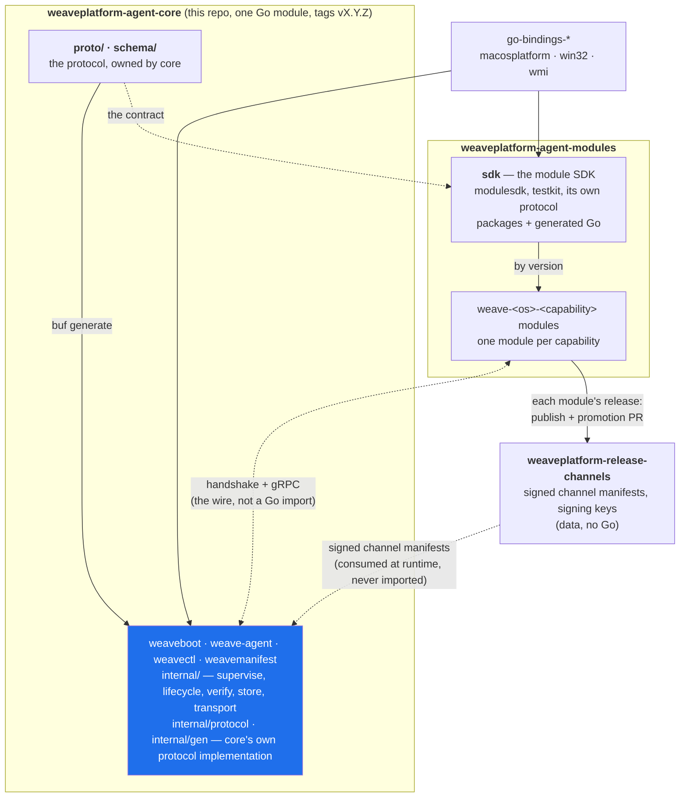
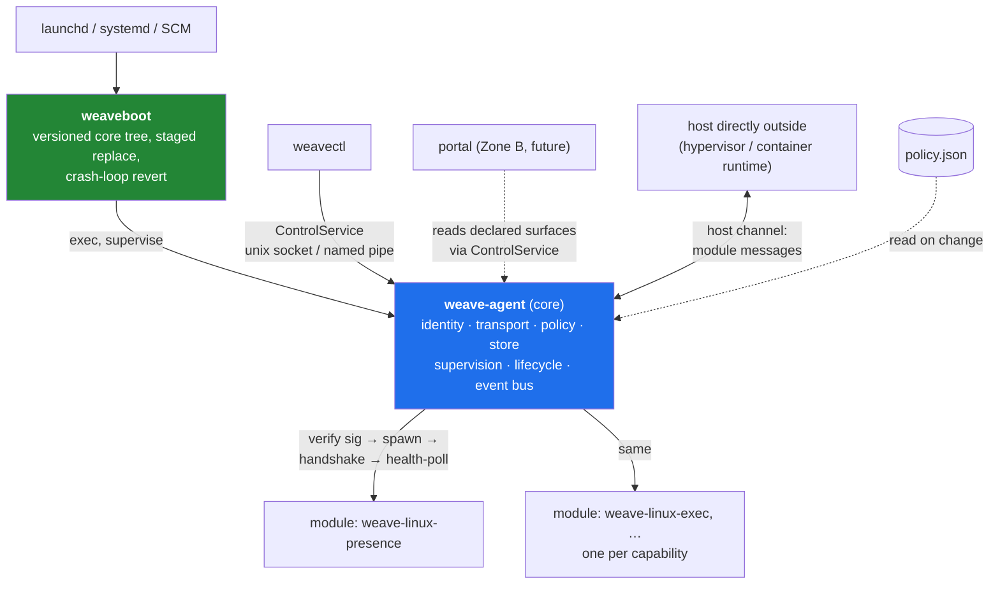
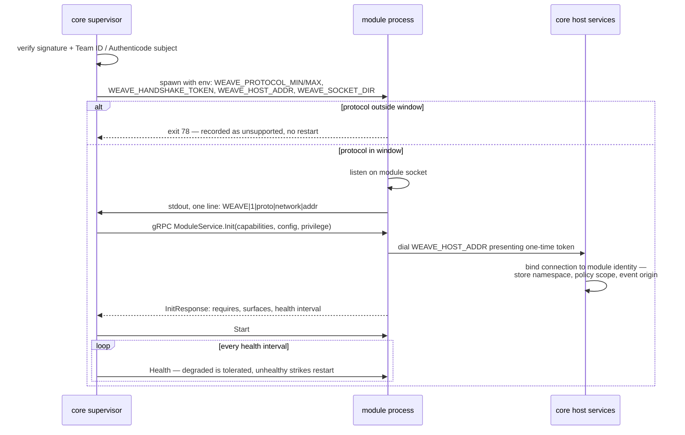
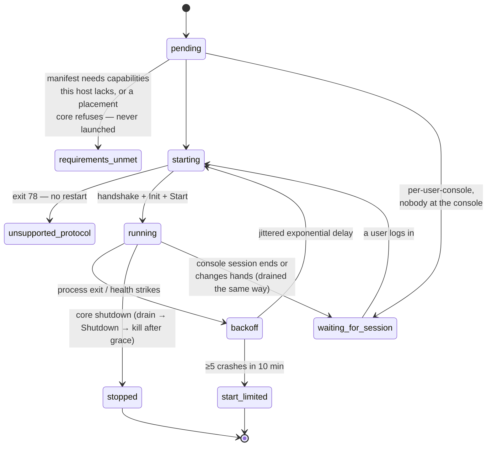
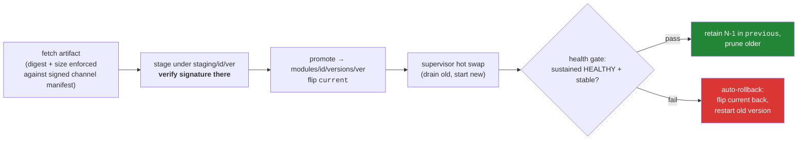
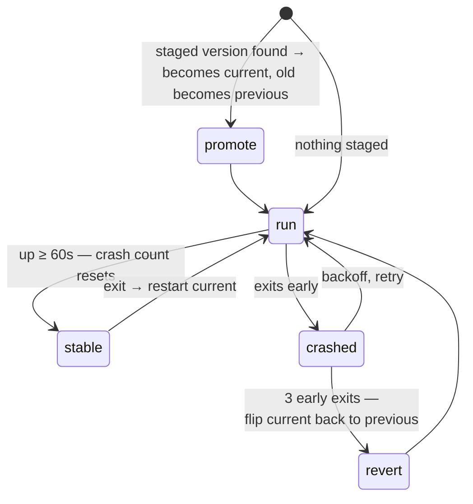

# Architecture

How the Weave platform agent is put together. [`spec.md`](../spec.md) is the governing
document — this explains how the pieces are built and how they relate. The one-line summary: one
agent, any device; **core is the surface, modules are the products**.

## The repositories

Three repositories, three roles. Core and modules never import each other: they meet on the
wire. Core owns that wire and keeps its own implementation of it; the module SDK and every
module live in `weaveplatform-agent-modules`; `weaveplatform-release-channels` is the signed registry.



**Core owns the protocol and keeps a private implementation of it** — the Terraform model
([`decisions/0001`](decisions/0001-core-owns-its-protocol.md)). Terraform core defines
`tfplugin5.proto`, generates its own `internal/tfplugin5`, implements the client in
`internal/plugin`, and never imports the provider SDK, which carries its own copy of the proto.
Here the same shape: `internal/protocol` (`handshake`, `ipc`, `hvchannel`, `manifest`),
`internal/{retry,wlog,werror,platform}`, and `internal/gen` generated from `proto/` by
`buf generate`. Core's own fixture modules speak the protocol directly rather than through
`modulesdk`, so core is tested against the wire.

**Core ships no SDK and no modules** ([`decisions/0001`](decisions/0001-core-owns-its-protocol.md)).
Terraform core keeps exactly one provider in its repository,
`internal/builtin/providers/terraform`; every other provider releases independently of core.
Here the module SDK (`github.com/weaveplatform/weaveplatform-agent-modules/sdk`) and every
module (`weave-<os>-<capability>`, for example `weave-linux-presence`) live in
`weaveplatform-agent-modules`, and each module releases and publishes itself from there. The
quality gate's `core-independent` job fails if this module depends on anything under
`weaveplatform-agent-modules` — a module or the module SDK — by import or by requirement.

What keeps the two sides compatible is the protocol, not a shared package: `buf breaking` on
`proto/`, the rules in [`PROTOCOL.md`](PROTOCOL.md), and `test/protocompat`, which runs a
module built against the protocol-1 SDK against today's core. The handshake line and
the `hvchannel` framing are hand-written on both sides, so a change to either is a protocol
change that lands here and in the module SDK.

`weaveplatform-release-channels` is deliberately not a Go dependency of anything: core consumes its
*documents* over HTTP and verifies them against a root key baked into core
(`internal/manifestverify`). A signing CVE is a core patch, not an SDK rebuild.

## Process model

Modules are separate binaries — Go cannot run in-process code built at a different time from
its host, so independent module versioning forces a wire boundary. The model is Terraform's:
launch a verified binary, handshake, speak gRPC over a local socket for the process lifetime.



The init system owns weaveboot and nothing else, on every platform: a systemd unit
(`packaging/linux/weave-agent.service`), a launchd plist, and on Windows the `WeaveAgent`
service — LocalSystem, automatic start, restart on any failure — which `weaveboot service
install` registers ([`windows-install.md`](windows-install.md)). Under the SCM weaveboot runs
the service control dispatcher and turns Stop / PreShutdown into the same context cancel a
SIGTERM is on unix. It then asks core to stop the way each platform allows — SIGTERM on
unix, `CTRL_BREAK` to core's own process group on Windows (delivered to core as
`os.Interrupt`) — and kills it only after 15 seconds of drain.

Three processes core does not parent: **weaveboot** (supervises core so it can replace it —
the relationship inverts), the **portal** (session lifecycle belongs to launchd), and any
**System Extension** (the OS owns it). Everything else is core's child; on Windows a Job
Object with kill-on-close guarantees module trees die with core.

## The handshake

Protocol compatibility is negotiated, never tabulated. Core advertises a `{min,max}` window;
each module speaks exactly one protocol integer. An out-of-window module exits with code 78
before listening — clean refusal, never a crash loop.



All host-service auth is per-connection: the token rides every RPC as metadata, and the
socket itself lives in the module's own 0700 directory (SDDL-ACL'd pipe on Windows). A module cannot name,
let alone reach, another module's namespace.

## Supervision

Each module runs under a per-module state machine (`internal/supervise`). It fails closed: a
module that cannot run safely does not run.



The start limit (systemd's `StartLimitBurst`, not a Fowler circuit breaker — there is no
half-open probe) pins the module down rather than restarting forever; a rollback or operator
action resets it. Crash counts only reset after the module proves stable (60s up).

Liveness is watched two ways. Core **polls** `ModuleService.Health` on the module's requested
cadence, and the module **pushes** a watchdog ping (the sd_notify WATCHDOG shape) over
`WatchdogService` every interval core sets in `InitRequest`. A module silent past two
intervals is restarted — a proactive signal that catches a module which can no longer
maintain its keepalive stream, without waiting on the next poll.

## The module registry

Core keeps one table of the modules installed on this machine (`internal/registry`). The
supervisor writes it: every module it registers, with its manifest identity (id, version,
channel address, required capabilities, privilege, session) and its supervision state (state
and detail, health, restarts, pid, and when it entered the state). A module leaves the table
only once it has stopped, when it is uninstalled or replaced.

Everything else reads it, so no two answers to "which modules are here, and are they up" can
disagree:

| Reader | What it does with it |
|---|---|
| `internal/transport` | explains a frame it could not deliver: no entry at the address is `not_installed`, an entry with no receiver is `not_running` with the entry's state |
| the host channel | `modules.list` and the `modules.changed` push to an authenticated host ([`PROTOCOL.md`](PROTOCOL.md#the-host-channels-control-address)) |
| `RegistryService` | the module view: id, version, address, state, health ([`services.md`](services.md)) |
| `ControlService.Modules` | `weavectl modules`, the operator view, which adds pid and detail |
| `internal/lifecycle` | the install health gate waits on the entry's state and health |

Core's module reload writes it too, for a module directory it cannot run: an `invalid`
entry with the reason as its detail, and no manifest identity
([Module reload](#module-reload)).

Watchers are woken on a change a reader would act on: a module added or removed, or any
of its identity, state, detail, pid, restarts or health status and reason changing. A health
poll that only refreshes the details map does not wake anyone — the supervisor re-records every
module on every poll, and a push to every host each time would bury the changes that matter.
Wake-ups coalesce, and every reader takes a whole snapshot with a `revision` that only
increases, so a slow reader skips to the latest state rather than replaying a backlog.

## Module reload

Core runs what its modules directory (`--modules-dir`, `/usr/lib/weave/modules` on a
packaged Linux install) holds, and keeps doing so while it runs: a module package installed,
upgraded or removed takes effect without restarting core, and without touching any module it
did not change. One pass (`internal/core/reconcile.go`) does it, and start-up is simply the
first pass.

A pass lists the directory and, for each module, reads it again and compares it with what
the supervisor is running:

| On disk | Running | The pass |
|---|---|---|
| a module | no | `Add`s it — verified before exec like every launch |
| a module with another manifest version, another binary (SHA-256, or another path, as a `current` flip gives) or another `config.json` | yes | `Replace`s it: drain the old process, start the new one |
| the same module | yes | nothing |
| nothing (directory gone, or the module is built for another host) | yes | `StopModule`: drain, stop, leave the registry |
| a directory that cannot run | either | stops it if it was running, records it `invalid` |

Anything else in the manifest is ignored, so a rewrite that changes nothing a module runs
with does not restart it. The supervisor's own replace semantics apply: the gated,
rolled-back promote is the lifecycle manager's (below), and a package upgrade has no retained
version to roll back to.

**Invalid is per module.** A manifest that does not parse, no binary, a `current` naming no
version, a manifest id that does not match its directory, an address another module already
answers to: that module is logged, recorded in the registry as `invalid` with the reason in
its detail — so `weavectl modules` and the host's `modules.changed` both show it — and every
other module carries on. A directory with no manifest at all is not a module yet (a package
manager between creating it and unpacking into it) and is skipped. **A modules directory
core cannot read at all is different.** At start-up it stops core: that is a broken install,
not an empty one, and a core that came up running nothing would look healthy to weaveboot
and systemd. In a later pass it changes nothing and is logged, because "could not look"
must not be read as "nothing installed" and stop every module.

**Four triggers, one pass.** All of them end in the same reconcile:

- **the directory watch** — inotify on Linux, on the modules directory and each module
  directory in it, following directories as they come and go;
- **SIGHUP** to weave-agent — `systemctl reload weave-agent` (`ExecReload`) signals weaveboot,
  systemd's main pid, which forwards it to core;
- **`ControlService.Reload`** — `weavectl reload`, which answers with what the pass did:
  modules added, removed and replaced, and every module still invalid;
- **the periodic rescan** — `--module-rescan` / `WEAVE_MODULE_RESCAN`, default one minute,
  `0` to disable: the safety net for a change nothing reported, and for macOS and Windows,
  which have no watch yet.

Passes are serialised, and the watch and SIGHUP go through a debounce: a trigger waits for
half a second of quiet (and never more than five seconds in all), so a package's burst of
file events is one pass. `weavectl reload` runs a pass at once and waits for its answer.

**Never a half-written binary.** dpkg writes each file as `<name>.dpkg-new` and renames it
into place, and the rename is atomic; the watch ignores `*.dpkg-*` names, and discovery only
ever opens the module's own file names. For anything that writes a binary in place, a pass
hashes the binary between two `stat`s and, if it changed while being read, leaves that
module alone and looks again after the debounce.

**Reload and install take turns.** The lifecycle manager replaces a module's process before
it flips `current`, so between the two the running version and the disk disagree. A pass
compares and acts on each module while holding the lifecycle manager's lock for that id —
the lock install and rollback hold — so it never sees a promote half done, and an install
waits for a pass on its module to finish. The lifecycle manager installs into the same
modules directory core reads, so `--modules-dir` moves both.

## Sessions

A manifest's `session` says where the module lives. `system` modules are core's children in
core's own session. `per-user-console` modules are core's children too — same verify,
handshake, health, backoff and start limit — but run **inside the session of the user at
the physical console, as that user**: clipboard, display and input only exist there. The
pairing with `privilege` is enforced at registration: `per-user-console` requires
`privilege: user` and `user` requires `per-user-console`, so a session module never runs as
root or as the service account, and "user" never means a user core has to invent.

`per-user-all` (one instance in every logged-in session, background and remote ones
included) is **refused** with `requirements-unmet`, which also fails an install's health
gate. The supervisor's model is one runner, one host-service identity and one store
namespace per module id; several live instances of one id would share all three. Nothing
needs it yet — the modules that want a session want the one at the console.

### Following the console

`internal/session` answers "who is at the console right now" with one source per OS, and a
watcher polls it every two seconds. Polling rather than notifications: each OS's change
signal needs different plumbing (an SCDynamicStore run loop, logind D-Bus signals, WTS
window or service-handler messages), and a console switch is a human-speed event.

| OS | Source | No user means |
|---|---|---|
| macOS | `SCDynamicStoreCopyConsoleUser` (go-bindings-macosplatform, purego) | `loginwindow`, `_mbsetupuser`, uid 0, or nobody |
| Linux | logind state files: `/run/systemd/seats/seat0` `ACTIVE=` → `/run/systemd/sessions/<id>` | no seat0, a greeter (`CLASS≠user`), a switched-away (`STATE≠active`) or remote session |
| Windows | `WTSGetActiveConsoleSessionId` + `WTSQuerySessionInformation(WTSUserName)` | no console session, session 0, or the logon screen (no user) |

On Linux the source also reports what a GUI process started outside the session would lack:
`XDG_RUNTIME_DIR` (logind's `RUNTIME=`), `WAYLAND_DISPLAY` (the compositor's `wayland-N`
socket in it), `DBUS_SESSION_BUS_ADDRESS` (its `bus` socket) and `DISPLAY` (recorded by
logind for X11 sessions only). Each is set only when the thing it names exists, and they
are part of the session's identity: a Wayland socket that appears a moment after login
restarts the module so it sees it. The state files are read rather than
`org.freedesktop.login1` over D-Bus — same data, no D-Bus client in core, and a test fake is
a directory of text files.

The runner per module: no session → `waiting-for-session` (weavectl shows
`waiting-for-session: no console user session`, or the probe error). A session appears →
start in it; `running` carries `console session <id> (<user>)` as its detail. The session
ends or changes hands (logout, fast user switching, a new login of the same user is a new
session) → the module is drained and stopped exactly as on shutdown, and the runner starts
over. **Backoff and the start limit are per session start**: a module that spends its
restart budget is `start-limited` until the console changes hands, and the next session
gets a fresh budget — a crash loop in one user's session says nothing about the next. A
protocol refusal (exit 78) is the binary's property and stays terminal. A probe failure
reads as "no session", never as "keep the last one": running in a session core cannot see
is how a module ends up in the wrong user's desktop.

Install's health gate treats `waiting-for-session` as a pass: the binary is verified, there
is nothing more to prove until someone logs in, and waiting for a login would fail every
install on an unattended host. The first session start is still supervised.

### Launching into the session

| OS | Mechanism |
|---|---|
| macOS | `launchctl asuser <uid> chroot -u <uid> -g <gid> -G <groups> / <module>` |
| Linux | plain exec with `SysProcAttr.Credential` (uid, gid, supplementary groups) and the session environment |
| Windows | `WTSQueryUserToken` → `CreateEnvironmentBlock` → `CreateProcessAsUser` onto `winsta0\default` |

**macOS.** The pasteboard and every other per-user GUI service are Mach services in the
user's `gui/<uid>` launchd domain, reached through the bootstrap port a process inherits.
A LaunchDaemon's setuid child is the right user in the wrong bootstrap: NSPasteboard finds
no pasteboard server. `launchctl asuser` moves onto the user's bootstrap and execs in place;
it leaves the process root, so `chroot(8)` — `-u -g -G`, then exec, also in place, with
`chroot("/")` a no-op — drops to the user. Neither forks, so the pid core holds, the stdout
handshake, exit status and kill all behave as for a direct child. Not a LaunchAgent
bootstrapped into `gui/<uid>`: launchd would own the process and core would lose the
handshake line, the exit status it classifies, and the kill on shutdown. Not
`posix_spawn` with the user's audit session: joining one is private SPI, where
`launchctl asuser` is the supported route to the same place. `-G` is capped at
`NGROUPS_MAX` (16), primary group first.

**Linux.** There is no kernel session object to join: the session is its uid and what logind
recorded, so the module gets the user's credentials and the environment above. It stays in
core's cgroup, not the session scope, so logind's `KillUserProcesses` does not reach it;
core stops it when the watcher sees the session end.

**Windows.** `WTSQueryUserToken` needs LocalSystem and returns the user's primary token —
the UAC-filtered one for an administrator, so a session module never runs elevated.
os/exec cannot do the launch: `SysProcAttr` takes a token but has no field for
`STARTUPINFO.lpDesktop`, and without `winsta0\default` the process lands on a
non-interactive window station — running, in the right session, with a private clipboard
nobody can see. The launch mirrors os/exec otherwise: stdio over pipes, only those three
handles inherited (`PROC_THREAD_ATTRIBUTE_HANDLE_LIST`), `CREATE_NO_WINDOW`, the user's own
environment block plus core's `WEAVE_*` and the handshake variables, and the job object as
for every module.

### Reaching core from the session

The module still dials its host socket and presents its token. The socket must admit it:

- **unix** — the per-module socket dir and `host.sock` are chowned to the user (0700 as
  ever); the run dir and `run/modules` become search-only for others (0711) so the user can
  traverse to its own dir without listing anyone else's; the host socket's peer-uid check
  admits root, core's uid and the module's uid. The binary is exec'd from a **root-owned,
  read-only copy** under `exec/<id>/` in the state directory — the installed tree is 0700
  root — and that copy is what gets verified, so the user cannot swap it between
  verification and exec ([Filesystem layout](#filesystem-layout)). The same
  applies to `service`-privilege modules when core runs as root, which could not reach
  their binaries or sockets either before this.
- **Windows** — the host pipe's SDDL adds `(A;;GRGW;;;<user SID>)` to the SYSTEM and
  Administrators entries. Pipes carry no peer-uid check (see `internal/protocol/ipc`), so as with a
  same-uid neighbour on unix, the one-time token is what separates the module from the
  user's other processes.

A non-root core (development) can start a session module only in its own user's session
and refuses any other rather than run it as the wrong user.

### What is verified where

The watcher, runner and every OS decision are covered with fakes on all three OSes. Real
launches into the tester's own session run in CI on macOS (through `launchctl asuser`,
skipped where the runner has no GUI domain) and Linux (logind fixtures for the source).
On Windows the launch path runs with the tester's own restricted token standing in for
`WTSQueryUserToken`, on the inherited desktop. **Not verified by any automated test:** a
root core's `chroot` drop on macOS and pasteboard access through it, a root core's
credential drop into a real logind session, and a LocalSystem core launching onto a real
user's `winsta0\default` — none of which a CI runner can provide. Those need a manual run
on a machine with a logged-in console user.

## Module install: stage → promote → rollback

The lifecycle manager (`internal/lifecycle`) owns install. Verify-before-exec is
non-negotiable: modules are fetched after install, so Gatekeeper and SmartScreen protect
nobody here.



The same shape applies one level up: **weaveboot** replaces core itself. An updater leaves a
new core under `core/staging/`; weaveboot promotes it at loop start and reverts a version
that cannot stay up. A promoted core is confirmed on **readiness, not uptime**: once modules
are registered and the control socket is up, core writes a readiness marker weaveboot cleared
before launch, so its presence proves the new core loads and configures — a fast, health-based
promotion gate, with the uptime timer as the fallback. The installed footprint (launchd plist,
service registration, signing identity — [`spec.md`](../spec.md) §9) never
changes; only the binaries behind it do.



## Filesystem layout

`internal/layout` resolves every directory core uses. The platform defaults come from
`internal/platform`; `--state-dir` (or `WEAVE_STATE_DIR`) moves the whole tree under one
root, which is how weaveboot always starts core — so on a packaged Linux install the run and
log directories are `/var/lib/weave/run` and `/var/lib/weave/logs`, not the platform's
`/run/weave` and `/var/log/weave`. Nothing below depends on which of the two it is.

| Directory | Linux | macOS | Windows | unix mode |
|---|---|---|---|---|
| `StateDir` | `/var/lib/weave` | `/Library/Application Support/Weave` | `%ProgramData%\Weave` | `0711` |
| `RunDir` — sockets | `/run/weave` | `/var/run/weave` | `StateDir\run` | `0711` |
| `ExecDir` — staged module binaries | `StateDir/exec` | `StateDir/exec` | `StateDir\exec` | `0711` |
| `LogDir` | `/var/log/weave` | `/Library/Logs/Weave` | `StateDir\logs` | `0700` |
| `StagingDir`, `ModulesDir`, `core/` | under `StateDir` | under `StateDir` | under `StateDir` | `0700` |

With `--state-dir <root>` every row is `<root>/<name>` (`run`, `exec`, `logs`, `staging`,
`modules`). `layout.Ensure` creates each directory and holds it at exactly that mode on every
start, in both directions: it closes a `0755` left by an installer and opens a `0700` left by
an older core.

The model, for a module that runs as another identity — a `service` module dropped to the
`weave-agent` (`_weaveagent` on macOS) account, or a per-user module dropped to the console
user:

- **Data is private.** Logs, staged artifacts, installed modules and core's own versions are
  `0700` root; the store and its sealed key are `0600` files directly in `StateDir`. Search
  permission on `StateDir` lets another identity reach a path it already knows, never list
  the directory or read those files.
- **The binary it runs is staged in `ExecDir/<id>/`**: a fresh root-owned `0555` copy in a
  root-owned `0755` directory, made, verified, then exec'd. The module's identity can read
  and execute it but not replace it between verification and exec. `ExecDir` is search-only,
  so no module lists another's copy.
- **`ExecDir` is under `StateDir`, never `RunDir`.** `RunDir` is `/run` on Linux, which
  Ubuntu and most distributions mount `noexec`; a binary staged there cannot be exec'd by
  anyone. The state volume is where core itself already executes from (`StateDir/core`).
- **Its socket dir is `RunDir/modules/<id>/`**, `0700` and chowned to the module's identity;
  `RunDir` and `RunDir/modules` are search-only, so it reaches its own dir and nobody else's.
  The control socket in `RunDir` is a `0600` root socket whose peer uid must be root or core.
- **Windows** holds the same boundaries with ACLs rather than modes: the installer protects
  `StateDir` to SYSTEM and Administrators, a module's image is opened with core's access by
  `CreateProcessAsUser`, and host endpoints are SDDL'd pipes. **Every** module is staged
  there, whatever it runs as, for a different reason: Windows keeps a running image's file
  open against deletion, so a module run from where it is installed could not be removed or
  replaced while it runs — an installer, the lifecycle manager's prune and the module reload
  would all be refused. Each launch copies the binary into a fresh directory under
  `ExecDir\<id>\`, inheriting `StateDir`'s ACL, and **verifies the copy**: the Authenticode
  signature is embedded, so the copy carries it, and checking the file actually exec'd leaves
  no gap between check and launch. The copy goes when the module stops (retried while
  Windows lets go of the image) and otherwise at the next launch or start-up sweep.

## Core's internal layout

| Package | Owns |
|---|---|
| `internal/supervise` | spawn, verify-before-exec, handshake, health, backoff, start limit, Job Objects, per-session launch |
| `internal/registry` | the one table of installed modules and their state; change notification ([The module registry](#the-module-registry)) |
| `internal/session` | who is at the console: per-OS source, polling watcher |
| `internal/hostserv` | per-module gRPC host services, token-gated: store, policy, events, identity, transport, log, watchdog, registry |
| `internal/store` | one bbolt file, bucket per namespace, AES-256-GCM per value (namespace+key as AAD), master key sealed by `keyprotect` (DPAPI / keyfile → Secure Enclave/TPM later) |
| `internal/policy` | read the local policy file on change, cache the last good document in the store, wake Watch streams on change ([Policy](#policy)) |
| `internal/identity` | Ed25519 device identity behind a Provider seam, local to the machine; per-module scoped credentials (fail closed today) |
| `internal/transport` | the host channel peer, durable offline queue |
| `internal/provision` | the channel trust anchor from a `WEAVEPROV` provisioning volume, only while none is installed ([Authentication](#authentication)) |
| `internal/lifecycle` | staged install, health-gated promote, N-1 retention, rollback |
| `internal/manifestverify` | two-tier Ed25519 chain verification for channel manifests |
| `internal/capability` | the one host probe at startup that gates module launch |
| `internal/eventbus` | at-most-once in-core pub/sub — the only lateral channel between modules |
| `internal/weaveboot` | versioned core tree, staged replace, crash-loop revert |
| `internal/winsvc` | Windows service: SCM dispatcher and stop handling, service registration, unattended install |
| `internal/controlsock` | ControlService for weavectl and (later) the portal |

## Policy

Core reads the device's policy set from one local file — `policy.json` in the state directory,
or `-policy-file` / `WEAVE_POLICY_FILE` — before any module starts, then checks it every
`-policy-interval` (default 30s) by modification time and size. Whoever administers the
machine, or the host that drives it, writes the file; write it to a temporary name and rename
it into place, so core never reads it half-written.

```json
{"revision": 4, "modules": {"weave-linux-presence": {"interval_seconds": 60}}}
```

Each module receives only its own entry, as opaque bytes; what is in it is the module's
business. `revision` is reported to modules but does not decide whether a change applies —
module content does, so an edit that forgets to bump it still takes effect, and a file
restored from a backup with a lower revision is applied rather than refused.

- **Missing file** — no policy. Every module's document is withdrawn and its `Watch` woken,
  exactly as if an empty set had been delivered.
- **Malformed file** (not JSON, or over 8 MiB) — logged once and ignored; the last good policy
  stays in force. Failing to "no policy" instead would let one mistyped edit revoke every
  module's policy at once. The last good document is cached in the store, so this holds across
  a restart too.
- **Unreadable file** (permissions) — retried every check, since the fix need not touch the
  file's modification time.

## The test that matters

`test/protocompat/v1` is a protocol-1 module with a pinned go.mod, built with
`GOWORK=off` so the pins decide what it links. Every CI run proves current core accepts it
in-window and refuses it cleanly once the window moves past it. A new protocol adds `vN/`
beside it ([`protocol-versioning.md`](protocol-versioning.md)); `v1/` stays. That property — negotiated compatibility that is
continuously proven — is what makes independent module versioning an asset instead of a
liability.

## The hypervisor channel

Core runs wherever a weave product needs to manage and control an OS, and how it
is reached depends on where that is:

| Where core runs | Who drives it | Over this channel |
|---|---|---|
| A VM, on a device or on a cloud host (guestweave; hostweave placing a job) | the hypervisor host's tooling | virtio-serial, vsock or HvSocket |
| A container, on a device or in the cloud (hostweave placing a job) | the container runtime's host | a Unix socket |

"Hypervisor channel" names the one connection core owns
to the host directly outside it, whether that host is a hypervisor or a
container runtime. Modules never see framing, device nodes or sockets: they
`Send` and `Receive` messages addressed to `PEER_HYPERVISOR`, and core
translates.

Which transport is chosen by `-channel` / `WEAVE_CHANNEL` (`capability.Channel`):

| Value | Transport | Claimed when |
|---|---|---|
| empty or `auto` | virtio-serial (default) | the named port is found (below); on Windows, the Hyper-V guest registry key is present |
| `virtio-serial` | virtio-serial, forced | as `auto` on Linux/macOS; on Windows, `\\.\Global\org.weave.agent.0` or `\\.\COM2` opens |
| `vsock:<port>` | AF_VSOCK, Linux only | `/dev/vsock` exists |
| `hvsocket:<port>` | AF_HYPERV, Windows only | the Hyper-V guest registry key is present |
| `unix:<absolute path>` | Unix socket, every OS (the container channel) | always (core creates the socket) |

A socket transport is **configured, never inferred**, for the reason the next
paragraph gives about `/dev/vsock`. A value core cannot honour — unknown, missing
its port, or a socket family this OS does not have — is logged as an error and
core runs **without a channel**: fail closed for the channel, not for core.

The probe identifies that device **by the port name the host publishes**
(`org.weave.agent.0`), never by node position. A virtio-serial port has no other
distinguishing feature, and the numbering moves with however many other console
ports the host configured. On Linux that means the udev symlink under
`/dev/virtio-ports/`, or — on a guest with no udev — the sysfs entry that carries
the same name. Nothing else counts: `/dev/vsock` in particular is present in
every weave guest for unrelated reasons, and claiming the channel on it gives
core a device that opens successfully and then delivers nothing, which is the
worst failure available because every log line still reads healthy.

The framing lives in `internal/protocol/hvchannel` — core's copy of the package the
host end imports from the module SDK — because the host end must encode identically and **nothing on
that wire would catch a mismatch** — no negotiation, no version exchange, so a field renamed on one side
just stops matching and the symptom is a guest that never answers.

Core owns exactly one connection because the frame protocol has **no
resynchronisation**: a second reader desynchronises the stream permanently rather
than degrading it. One fd, one read loop, one write mutex.

### Socket channels

Hyper-V (HCS) guests have no virtio-serial. On vsock and HvSocket the **host
dials and the guest listens**, so core listens on the configured port (Linux:
AF_VSOCK, any CID; Windows: AF_HYPERV, wildcard VM id, service
`<port as 8 hex digits>-facb-11e6-bd58-64006a7986d3` — the same identity Hyper-V
maps a Linux guest's vsock port to, so the host dials one service id for either
guest OS). The probe claims `hypervisor.channel` as `{kind: vsock|hvsocket, port}`;
a port in the attributes is what tells the transport to listen rather than open
a device.

A Windows guest may only listen on a service registered under
`HKLM\SOFTWARE\Microsoft\Windows NT\CurrentVersion\Virtualization\GuestCommunicationServices\<service id>`
(with an `ElementName`); an unregistered bind fails with a Winsock error that does
not say why. Core creates the registration at startup when it is missing, which
needs an elevated core (the service runs as LocalSystem); if it cannot, it logs
the key it needed and the listen fails.

The single-owner rule holds over time: **each new host connection replaces the
previous one**, which is closed. A host reconnects after it restarts, and two
readers on one wire is the failure this design exists to prevent, so the newest
connection wins. Every connection starts **unauthenticated** — proof given on an
earlier connection says nothing about who is on this one.

While no host is connected the peer is absent and `queue_offline` sends queue.
A connected host that has not authenticated is refused module traffic, so those
sends queue too rather than being lost. The queue is flushed when a connection
**authenticates** (on any transport — before, a queue left behind by an
unauthenticated peer waited for the next module send to trigger a flush).

What has not been exercised: the AF_HYPERV listen against a real Hyper-V host
(the Winsock plumbing is tested over loopback TCP, the registration under HKCU),
and AF_VSOCK against a real host (tested over the kernel's vsock loopback where
the test host has it).

A frame that will not decode costs one message, not the channel — the length
prefix has already kept the reader aligned, so the loop logs and continues. Only
a stream-level failure ends it. Getting that classification backwards would let
one malformed frame silently kill a channel core cannot re-establish, with the
guest still looking healthy.

### The container channel

A container has no hypervisor between it and its host, so the channel is a Unix
socket in a directory the container host bind-mounts (for example
`-v /run/weave/<container>:/run/weave` with `WEAVE_CHANNEL=unix:/run/weave/channel.sock`).
As with vsock, **core listens and the host dials**, every connection replaces
the previous one and starts unauthenticated, and the same channel key admits
the host — the socket's mode (owner only) is a second fence, not the first.

A socket left by a previous core is replaced, so a restart can always bind;
anything else at the path is refused rather than deleted. Windows containers use
the same kind: Windows has had AF_UNIX since 10 1803, and the path is a Windows
absolute path.

### Authentication

Anything on the host that can reach the channel can drive the guest — power it
off, run a command in it, read its inventory — so the channel authenticates its
peer before honouring any of that. Without it the boundary is "whoever got to the
file descriptor first", which is not a boundary.

The guest holds an Ed25519 public key (`/etc/weave/channel.pub`,
`%ProgramData%\weave\channel.pub` on Windows, or `--channel-pub`); the host holds the
private half in the VM's directory. The guest issues a single-use nonce, the host signs it, the
guest checks the signature against the key it already trusts. The frames and the
signing message live in `internal/protocol/hvchannel` (and the module SDK's copy) for the same
reason the framing does: both ends must build them identically and nothing on this wire would
catch a mismatch.

**The key — the trust anchor — only ever arrives out of band**, from boot media the host
supplies: baked into the image, written by a cloud-init seed (Linux), or copied from a
provisioning volume (macOS and Windows, which have no cloud-init). Nothing on the channel
sets or changes it, authenticated or not. An in-band rekey was considered and rejected: a
stolen key could use it to persist and lock the owner out, and it would put a trust-changing
operation on the one wire an attacker on the host can reach.

**The provisioning volume** (`internal/provision`) is a read-only filesystem labelled
`WEAVEPROV` holding `weave/channel.pub`. At start, before the channel loads its key, and
**only if nothing is at the anchor path**, core reads the key, validates it exactly as the
channel loads keys (one standard-base64 Ed25519 key), and installs it: written in full to a
temporary sibling, made `0644` root (on Windows a protected ACL: SYSTEM and Administrators
full, Users read), then hard-linked into place. A link, unlike a rename, fails if the anchor
exists, so even an anchor that appeared a moment earlier is never replaced, and the anchor
never exists half-written. Core logs the key's fingerprint (`sha256:` and the hex SHA-256 of
the 32 key bytes).

- **Anything at the anchor path ends it**, valid key or not; the volume is not read. A guest
  whose anchor is wrong is fixed by whoever administers it, not by media.
- **Where it looks.** macOS: `/Volumes/WEAVEPROV`, which must be the root of a read-only
  mount made by the system (statfs: the mount point, `MNT_RDONLY`, owner uid 0) — a directory
  someone made, or a disk image a user attached with `hdiutil`, is refused. Windows: the drive
  whose volume label is `WEAVEPROV`, read-only (`FILE_READ_ONLY_VOLUME`). Linux: a filesystem
  udev lists under `/dev/disk/by-label/WEAVEPROV` that is already mounted read-only; core does
  not mount it, since Linux guests have cloud-init. Two such volumes are refused rather than
  chosen between. The host must attach the volume read-only.
- **A volume mounted late.** macOS mounts an attached disk some seconds into boot, often after
  core has started. If there is neither an anchor nor a volume at start, core looks again every
  2 seconds for 3 minutes, then stops for good: an unprovisioned guest is a legitimate state
  and is not polled for. The channel, which found no key, reads the anchor path again when a
  host next authenticates, keeps the first key it finds, and never replaces it while it runs.
- **A key it will not trust** (not base64, not 32 bytes, over 4 KiB, a symlink, missing) is
  logged and provisioning stops; the channel stays closed, as for any unprovisioned guest.

What this does not defend against: an administrator in the guest, who can write the anchor
directly; and, during the minutes before an unprovisioned guest's anchor is installed, a
process that can mount a filesystem as root. Both already control the guest.

Scope is **per VM**, not per host. A process able to drive VM A therefore cannot
drive VM B, which one host-wide key would have allowed the moment it leaked.

It **fails closed**, in both directions. An unauthenticated peer is refused every
operation, and a module's unsolicited output is not sent to one either — an
attacker who cannot ask a question but can read every answer has most of what they
wanted. A guest with no key file authenticates nobody, which is the right answer
for an unprovisioned image.

Two things cross an unauthenticated channel, deliberately: the handshake, and the
presence capability's hello (`weave.presence.hello`, and `guestweave.presence.hello`, the
hello the guestweave host CLIs send). That exemption is what lets a caller tell
"wrong key" from "no agent here" — two situations needing completely different
responses from an operator, which a channel that answered nothing would make
identical. Neither discloses more than the channel's existence already does.

A refusal is sent, not merely logged. Silence would leave the caller waiting out a
timeout indistinguishable from a guest that is not there.

The same reasoning applies after authentication. A frame for a module that is not
installed, has no receiver open, or whose inbound queue is full is answered with
`delivery.failed` on the channel's own address, carrying the reason and, for a module that
is installed but not running, its state from the [registry](#the-module-registry). Before
authentication core stays silent about it, since naming which modules are installed is more
than the hello exemption is for. The host matches the answer to its call by the envelope's
optional `id`, which core echoes; core never reads the opaque `data` to find one
([`PROTOCOL.md`](PROTOCOL.md#the-host-channels-control-address)).

The `weave-<os>-<capability>` modules in `weaveplatform-agent-modules` are what runs on the
other side of it.

## What is deliberately not here yet

- **Portal (Zone B)** — UI surfaces are already declared as data and brokered through
  ControlService; nothing draws yet.
- **Zone C** (System Extensions, cgo) — the capability probe and manifest zone field are the
  seams.
- **`per-user-all` sessions** — refused (see [Sessions](#sessions)); `per-user-console` is
  what clipboard, display and input need.
